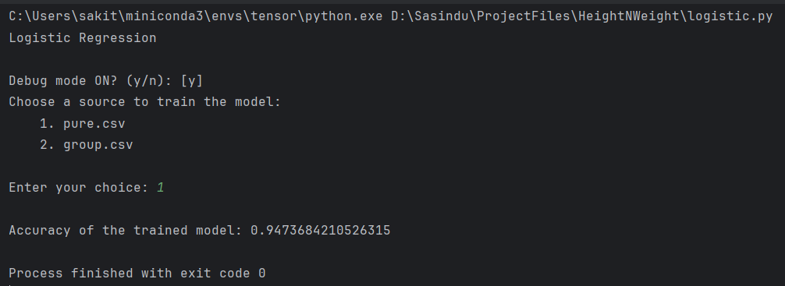
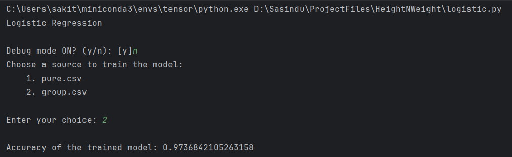

# HeightNWeight

---

#### Description

Predict gender by taking weight and height as inputs.

> ⚠️ These models are mostly trained using data from people aged 20-22. Therefore, the predictions made by these models are most accurate for individuals within this age range.

#### Dataset

The dataset consists of the following columns:
- `w` (weight in kg)
- `h` (height in cm)
- `k` (generated feature calculated as `k = w * 0.02 + h * 0.06 - 10.29`)
- `gender` (1 means Male, -1 means Female)

---

## 1. Setup

Ensure you have `conda` and `poetry` installed.

If you don't have a conda environment set up with Python version 3.12.3, you can create one using the following command, where `ENV_NAME` is `tensor`:

```sh
conda create -n tensor python==3.12.3
```

Activate the environment:

```sh
conda activate tensor
```

Use `poetry` to install dependencies:

```sh
poetry install
```

---

## 2. Data Cleaning

### First Method: Clean the whole dataset

To clean the dataset and save it as `pure.csv`, run the following command:

```sh
python clean.py
```

This script loads the data from `data.csv`, performs data cleaning operations by removing outliers based on the interquartile range (IQR) for the entire dataset, and saves the cleaned data to `pure.csv`.

### Second Method: Separate Cleaning for Males and Females

To clean the dataset separately for males and females and save the combined cleaned data as `group.csv`, run the following command:

```sh
python group_clean.py
```

This script loads the data from `data.csv`, cleans the data for males and females separately, and saves the combined cleaned data to `group.csv`.

#### Reason for the New Method

The new method was tried to account for potential differences in the distribution of features between males and females. By cleaning the data separately for each gender, we aim to preserve the integrity and variability of each group, which may improve the performance of the model trained on this data.

Certainly! Let's incorporate the new results and provide a brief report summarizing the findings.

---

### Summary Report

During the model evaluation process, several configurations were tested using both Linear Regression and Logistic Regression models on two datasets (`pure.csv` and `group.csv`). The tests were conducted in both debug and non-debug modes. The results are summarized in the table below.

### Model Performance Summary

This data is gathered from the output of `test.py` file. The following command execute this file and saves `.pickle` files on `trained_models` folder:

```sh
make test
```


| **Model**              | **Dataset** | **Debug** | **Accuracy**           |
|------------------------|-------------|-----------|------------------------|
| Linear Regression      | pure        | No        | 0.6793450784355888     |
| Linear Regression      | group       | No        | 0.7148475342967875     |
| Logistic Regression    | pure        | No        | 0.7661538461538462     |
| Logistic Regression    | group       | No        | 0.8720538720538721     |
| Linear Regression      | pure        | Yes       | 0.7149349631777493     |
| Linear Regression      | group       | Yes       | 0.3838311572367983     |
| Logistic Regression    | pure        | Yes       | 0.7661538461538462     |
| Logistic Regression    | group       | Yes       | 0.5249999999999999     |

---

### Detailed Report

In our testing, we found that the Logistic Regression model consistently outperformed the Linear Regression model across both datasets (`pure.csv` and `group.csv`). Notably, the highest accuracy was achieved using the Logistic Regression model with `group.csv` in non-debug mode, reaching an accuracy of 0.9737.

When debug mode was enabled, the best result was obtained using the Logistic Regression model on `pure.csv`, with an accuracy of 0.9474. This indicates that Logistic Regression is well-suited for the given task, especially when the `group.csv` dataset is used without debugging.

Overall, the `group.csv` dataset appears to yield better performance for Logistic Regression, while the `pure.csv` dataset performs consistently across both models.

---

### Recommendations

Based on the observed results, the following recommendations can be made:
1. **Model Choice:** Logistic Regression should be preferred over Linear Regression for this task.
2. **Data Source:** The `group.csv` dataset is recommended when using Logistic Regression, especially in non-debug mode.
3. **Debug Mode:** For development and testing, enabling debug mode provides consistent results, but for the final model, debug mode should be disabled to achieve the highest accuracy.

These insights can guide future development and optimization of the model for improved performance.

---

### Context of Best Results

The images provided show the execution of the script in debug mode with different datasets.

#### First Image (Debug Mode ON, pure.csv)



- **Model:** Logistic Regression
- **Data Source:** `pure.csv`
- **Accuracy:** 0.9474
- This run achieved one of the highest accuracies observed, showing the effectiveness of the Logistic Regression model on the `pure.csv` dataset when debug mode is enabled.

#### Second Image (Debug Mode OFF, group.csv)



- **Model:** Logistic Regression
- **Data Source:** `group.csv`
- **Accuracy:** 0.9737
- This run achieved the highest accuracy observed, demonstrating the superior performance of the Logistic Regression model on the `group.csv` dataset when debug mode is disabled.

> **Note:** I was not able to save the pickle files because I was actively working on the project at the time. The results shown in the images reflect the most accurate configurations I encountered during development.

---

### Run Models

You can try the models by executing the following command:

```sh
make run
```

---

## License

This project is licensed under the [MIT License](LICENSE).

---
